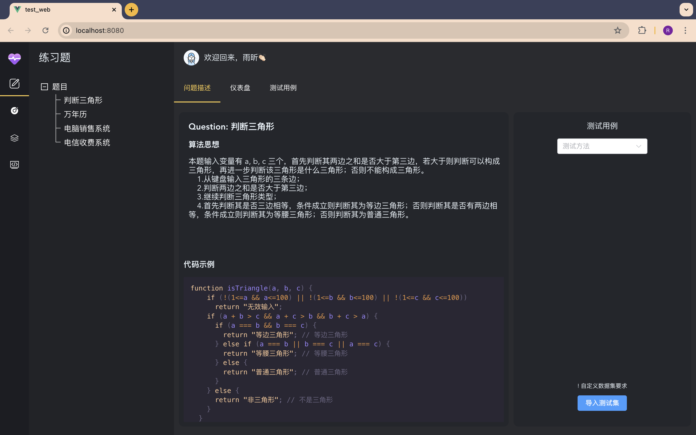
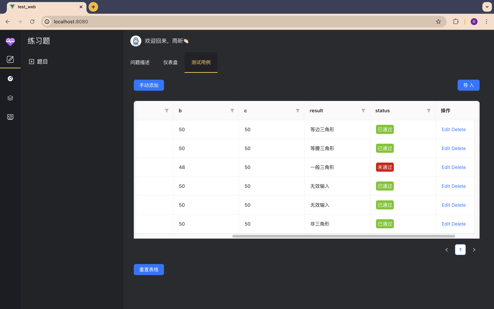
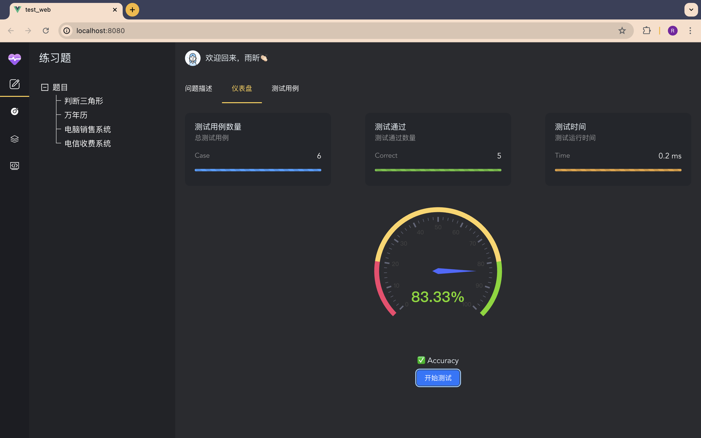
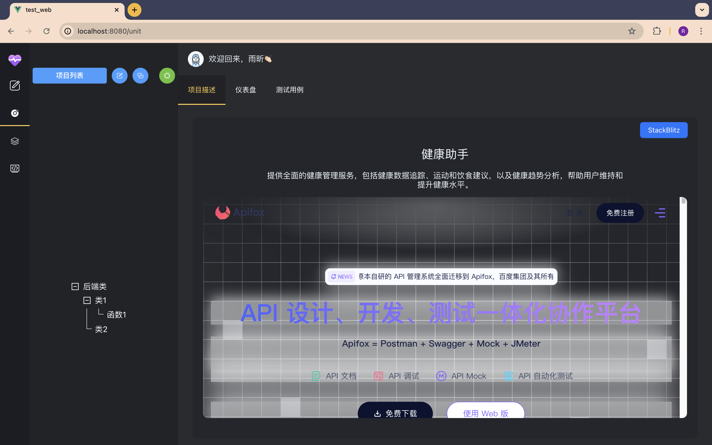

# test_web

本项目为自动化测试工具的前端代码。利用vue3+element-plus+pinia等实现自动化测试网站搭建。

**功能特点**：

* 测试用例统一管理
* 单元测试集成Junit进行自动统计
* 练习题目实时执行

**网站部分截图**









## Project setup

```
npm install
```

### Compiles and hot-reloads for development
```
npm run serve
```

### Compiles and minifies for production
```
npm run build
```

### Lints and fixes files
```
npm run lint
```

### Customize configuration
See [Configuration Reference](https://cli.vuejs.org/config/).
